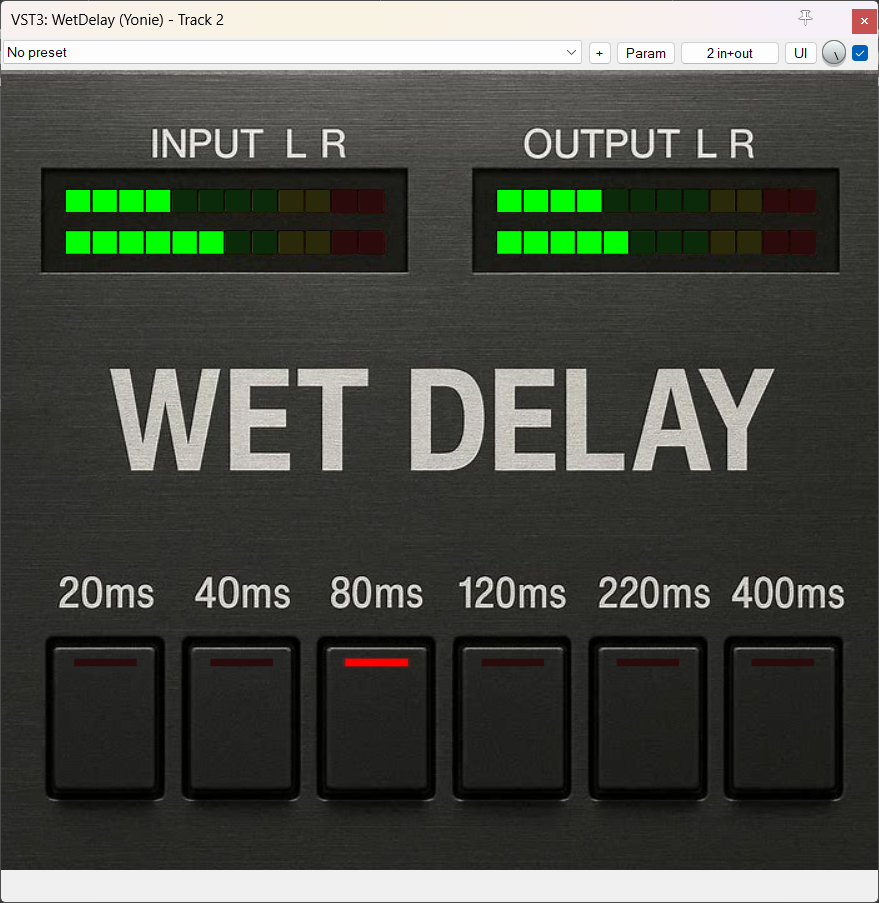

# WET Delay VST3 Plugin


A professional stereo delay VST3 plugin with authentic 80s rack-style digital delay character.



## Features

- **100% Wet Delay**: Pure delayed signal output with no dry signal mix
- **6 Delay Times**: Switchable delay times (20ms, 40ms, 80ms, 120ms, 220ms, 400ms)
- **Stereo Processing**: Independent left and right channel delay processing
- **Visual Metering**: Real-time peak level meters for input and output
- **VST3 Automation**: Full parameter automation support in DAWs

### 80s Rack-Style Character

- **24 kHz Internal Sample Rate**: Authentic vintage digital delay processing with band-limited frequency response
- **12-bit Quantization**: Classic gritty digital character with 4096 discrete levels
- **TPDF Dither**: Smooth quantization with triangular probability density function dither (0.5 LSB)
- **-80 dBFS Noise Floor**: Realistic analog electronics and ADC/DAC noise simulation
- **Vintage Filtering**: 80 Hz high-pass and 9 kHz low-pass (6 dB/oct) for warm character
- **Channel Crosstalk**: Authentic -40 dB (1%) L/R channel bleed simulating analog circuitry

## System Requirements

### Windows
- **Operating System**: Windows 10/11 (64-bit)
- **Build Tools**: 
  - Visual Studio 2022 Build Tools or Community Edition
  - CMake 3.15 or higher
  - Git

### Linux
- **Operating System**: Linux (x86_64)
- **Build Tools**:
  - GCC or Clang with C++17 support
  - CMake 3.15 or higher
  - Git
- **Dependencies** (Ubuntu/Debian):
  ```
  sudo apt-get install cmake gcc g++ libstdc++6 libx11-xcb-dev libxcb-util-dev \
      libxcb-cursor-dev libxcb-xkb-dev libxkbcommon-dev libxkbcommon-x11-dev \
      libfontconfig1-dev libcairo2-dev libgtkmm-3.0-dev libsqlite3-dev \
      libxcb-keysyms1-dev git
  ```

### macOS
- **Operating System**: macOS 10.13 or higher (Intel) / macOS 11.0 or higher (Apple Silicon)
- **Build Tools**:
  - Xcode Command Line Tools or Xcode
  - CMake 3.15 or higher
  - Git

## Quick Start

### Building the Plugin

#### Windows
1. **Clone and build in one step:**
```batch
build.bat
```

2. **Install to VST3 folder:**
```batch
install.bat
```

#### Linux
1. **Install dependencies:**
```bash
sudo apt-get install cmake gcc g++ libstdc++6 libx11-xcb-dev libxcb-util-dev \
    libxcb-cursor-dev libxcb-xkb-dev libxkbcommon-dev libxkbcommon-x11-dev \
    libfontconfig1-dev libcairo2-dev libgtkmm-3.0-dev libsqlite3-dev \
    libxcb-keysyms1-dev git
```

2. **Clone VST3 SDK:**
```bash
git clone --recursive https://github.com/steinbergmedia/vst3sdk.git
```

3. **Build:**
```bash
chmod +x build.sh
./build.sh
```

4. **Install to user VST3 folder:**
```bash
chmod +x install.sh
./install.sh
```

#### macOS
1. **Install Xcode Command Line Tools:**
```bash
xcode-select --install
```

2. **Clone VST3 SDK:**
```bash
git clone --recursive https://github.com/steinbergmedia/vst3sdk.git
```

3. **Build:**
```bash
chmod +x build.sh
./build.sh
```

4. **Install to user VST3 folder:**
```bash
chmod +x install.sh
./install.sh
```

5. **Load in your DAW** and start using!

## Installation

### Windows

1. **Download** the latest release from [GitHub Releases](https://github.com/yonie/wetdelay/releases)
2. **Extract** the ZIP file
3. **Copy** `WetDelay.vst3` to your VST3 folder:
   - User: `C:\Users\[Username]\Documents\VST3\`
   - System: `C:\Program Files\Common Files\VST3\`
4. **Restart your DAW** and rescan plugins

### Linux

1. **Download** the latest release from [GitHub Releases](https://github.com/yonie/wetdelay/releases)
2. **Extract** the ZIP file
3. **Copy** `WetDelay.vst3` to your VST3 folder:
   - User: `~/.vst3/`
   - System: `/usr/lib/vst3/`
4. **Restart your DAW** and rescan plugins

### macOS

1. **Download** the latest release from [GitHub Releases](https://github.com/yonie/wetdelay/releases)
2. **Extract** the ZIP file
3. **Copy** `WetDelay.vst3` to your VST3 folder:
   - User: `~/Library/Audio/Plug-Ins/VST3/` (recommended)
   - System: `/Library/Audio/Plug-Ins/VST3/` (requires admin)
4. **Remove quarantine attribute** (see Troubleshooting below)
5. **Restart your DAW** and rescan plugins

#### ❗️ Why macOS Blocks This Plugin

When you try to load the plugin in your DAW, you may see an error:

> "WetDelay.vst3" cannot be opened because the developer cannot be verified.

This **does not mean** the plugin contains malware or is unsafe.

This is due to **Apple's security policy**, which requires developers to:
- Enroll in the Apple Developer Program
- Pay **$99/year** for a developer certificate
- Notarize each build with Apple

As an independent developer releasing **free, open-source software** under the MIT license, I currently don't have the budget for Apple's developer program. The complete source code is available on GitHub for anyone to inspect and build themselves.

This is a common issue with free audio plugins on macOS. You'll encounter the same message with many free, open-source VSTs.

#### 🛡️ How to Allow the Plugin

macOS adds a security attribute (`com.apple.quarantine`) to files downloaded from the internet. Remove it with Terminal:

**For user installation:**
```bash
sudo xattr -rd com.apple.quarantine ~/Library/Audio/Plug-Ins/VST3/WetDelay.vst3
```

**For system-wide installation:**
```bash
sudo xattr -rd com.apple.quarantine /Library/Audio/Plug-Ins/VST3/WetDelay.vst3
```

**What this command does:**
- `sudo` = run with administrator privileges
- `xattr` = extended attribute tool
- `-r` = recursive (process all files in the bundle)
- `-d` = delete the specified attribute
- `com.apple.quarantine` = the quarantine attribute
- Restarts your DAW after running the command

#### 📝 Optional: Ad-Hoc Code Signing (Recommended)

Some DAWs require plugins to be signed, even locally. You can sign the plugin yourself:

**For user installation:**
```bash
codesign --force --deep --sign - ~/Library/Audio/Plug-Ins/VST3/WetDelay.vst3
```

**For system-wide installation:**
```bash
sudo codesign --force --deep --sign - /Library/Audio/Plug-Ins/VST3/WetDelay.vst3
```

This creates a local signature on your machine that satisfies macOS requirements.

#### ❤️ Support Independent Developers

If you appreciate this plugin and the transparency about macOS's developer fees, consider:
- **Starring the repo** on GitHub
- **Reporting issues** you encounter
- **Supporting development** at [buymeacoffee.com/yonie](https://buymeacoffee.com/yonie)

Your support helps fund tools like Apple Developer Program enrollment for better macOS support in the future.

---

## Detailed Build Instructions

### Step 1: Prerequisites

#### Windows
Install the required build tools using winget (Windows Package Manager):

```batch
winget install Git.Git
winget install Kitware.CMake
winget install Microsoft.VisualStudio.2022.BuildTools
```

Or download manually:
- [Visual Studio 2022](https://visualstudio.microsoft.com/downloads/) (Build Tools or Community)
- [CMake](https://cmake.org/download/) (3.15+)
- [Git](https://git-scm.com/downloads)

#### Linux
Install the required packages:

**Ubuntu/Debian:**
```bash
sudo apt-get install cmake gcc g++ libstdc++6 libx11-xcb-dev libxcb-util-dev \
    libxcb-cursor-dev libxcb-xkb-dev libxkbcommon-dev libxkbcommon-x11-dev \
    libfontconfig1-dev libcairo2-dev libgtkmm-3.0-dev libsqlite3-dev \
    libxcb-keysyms1-dev git
```

**Fedora/RHEL:**
```bash
sudo dnf install cmake gcc gcc-c++ libstdc++-devel libxcb-devel libxkbcommon-devel \
    libxkbcommon-x11-devel cairo-devel gtkmm30-devel sqlite-devel
```

**Arch Linux:**
```bash
sudo pacman -S cmake gcc libxcb libxkbcommon cairo gtkmm3 sqlite
```

#### macOS
Install Xcode Command Line Tools:

```bash
xcode-select --install
```

Homebrew packages (optional, for additional dependencies):
```bash
brew install cmake
```

### Step 2: Clone VST3 SDK

If the `vst3sdk` folder is not present, clone it:

```batch
git clone --recursive https://github.com/steinbergmedia/vst3sdk.git
```

### Step 3: Build

#### Windows
Run the automated build script:

```batch
build.bat
```

This will:
- Configure CMake for Visual Studio 2022
- Build the plugin in Release mode
- Run the VST3 validator (47 automated tests)
- Output: `WetDelay\build\VST3\Release\WetDelay.vst3`

#### Linux
Run the automated build script:

```bash
chmod +x build.sh
./build.sh
```

This will:
- Configure CMake with GCC/Clang
- Build the plugin in Release mode
- Run the VST3 validator (47 automated tests)
- Output: `WetDelay/build/VST3/Release/WetDelay.vst3`

#### macOS
Run the automated build script:

```bash
chmod +x build.sh
./build.sh
```

This will:
- Configure CMake with Clang
- Build the plugin in Release mode
- Run the VST3 validator (47 automated tests)
- Output: `WetDelay/build/VST3/Release/WetDelay.vst3`

### Step 4: Install

#### Windows
To install the plugin to your system's VST3 folder:

```batch
install.bat
```

**Note**: You may need to run as Administrator if you encounter permission errors.

#### Linux
To install the plugin to your user VST3 folder:

```bash
chmod +x install.sh
./install.sh
```

This installs to `~/.vst3/WetDelay.vst3`

#### macOS
To install the plugin to your user VST3 folder:

```bash
chmod +x install.sh
./install.sh
```

This installs to `~/Library/Audio/Plug-Ins/VST3/WetDelay.vst3`

**Note for macOS:** The plugin is unsigned. On first load, you may need to:
- Right-click the plugin and select "Open" 
- Or run: `xattr -cr ~/Library/Audio/Plug-Ins/VST3/WetDelay.vst3`

### Manual Installation

#### Windows
Alternatively, copy the built plugin manually:

```batch
xcopy /Y /I WetDelay\build\VST3\Release\WetDelay.vst3 "%COMMONPROGRAMFILES%\VST3\WetDelay.vst3\"
```

#### Linux
Alternatively, copy the built plugin manually:

```bash
mkdir -p ~/.vst3
cp -r WetDelay/build/VST3/WetDelay.vst3 ~/.vst3/
```

Or system-wide installation:
```bash
sudo cp -r WetDelay/build/VST3/WetDelay.vst3 /usr/lib/vst3/
```

#### macOS
Alternatively, copy the built plugin manually:

```bash
mkdir -p ~/Library/Audio/Plug-Ins/VST3
cp -r WetDelay/build/VST3/Release/WetDelay.vst3 ~/Library/Audio/Plug-Ins/VST3/
```

## Usage

1. **Load the plugin** in your DAW (Reaper, Cubase, Ableton Live, FL Studio, etc.)
2. **Select delay time** using the Delay Time parameter (0-5 for 6 positions)
3. **Monitor levels** using the built-in input/output meters
4. **Automate** the delay time parameter for creative effects

### Parameter Reference

| Parameter | Range | Default | Description |
|-----------|-------|---------|-------------|
| Delay Time | 0-5 | 0 | Selects delay time: 0=20ms, 1=40ms, 2=80ms, 3=120ms, 4=220ms, 5=400ms |

### Delay Times

| Position | Delay Time |
|----------|------------|
| 0 | 20 ms |
| 1 | 40 ms |
| 2 | 80 ms |
| 3 | 120 ms |
| 4 | 220 ms |
| 5 | 400 ms |

## Technical Details

### Architecture

- **Framework**: VST3 SDK (Official Steinberg)
- **Language**: C++17
- **Build System**: CMake (MSBuild on Windows, Make on Linux)
- **GUI**: VSTGUI4

### Audio Processing

- **Host Sample Rates**: Supports 22.05 kHz to 384 kHz
- **Internal Sample Rate**: 24 kHz (80s rack-style)
- **Host Bit Depth**: 32-bit float processing
- **Internal Bit Depth**: 12-bit quantization with dither
- **Latency**: User-controlled (20-400ms delay)
- **CPU Usage**: <0.5% (typical)
- **Memory**: ~200 KB

### Implementation Details

- **Delay Engine**: Circular buffer at 24 kHz internal rate
- **Resampling**: Linear interpolation with anti-aliasing and reconstruction filters
- **Quantization**: 12-bit uniform quantization with TPDF dither
- **Noise Floor**: Fixed -80 dBFS analog-style noise
- **Filtering**: 1st-order high-pass (80 Hz) and low-pass (9 kHz)
- **Crosstalk**: 1% (-40 dB) bidirectional channel bleed
- **Metering**: Atomic peak detection with exponential decay
- **Thread Safety**: Lock-free atomic operations for GUI communication
- **Buffer Size**: Pre-allocated for 400ms @ internal sample rate

## Project Structure

```
WetDelay/
├── vst3sdk/                    # VST3 SDK (git submodule)
├── WetDelay/                   # Plugin source
│   ├── source/
│   │   ├── wetdelayprocessor.h/cpp    # Audio processing
│   │   ├── wetdelaycontroller.h/cpp   # Parameter control
│   │   ├── delaybuffer.h/cpp          # Delay buffer implementation
│   │   ├── wetdelaycids.h             # Plugin IDs
│   │   └── version.h                  # Version info
│   ├── resource/
│   │   └── wetdelayeditor.uidesc      # GUI definition
│   ├── CMakeLists.txt                 # Build configuration
│   └── build/                         # Build output (generated)
├── build.bat                   # Build automation script
├── install.bat                 # Installation script
├── LICENSE                     # MIT License
└── README.md                   # This file
```

## Validation Results

The plugin passes all official VST3 validation tests:

✅ **47 tests passed, 0 tests failed**

Key validations:
- Valid state transitions
- Proper bus configuration
- Correct parameter handling
- Sample rate support (22.05 kHz - 384 kHz)
- Thread safety
- Preset save/load
- Plugin suspend/resume

## Troubleshooting

### macOS Issues

**Plugin not appearing in DAW:**
- You forgot to remove the quarantine attribute - see Installation section above
- Restart your DAW after running the `xattr` command
- Check VST3 scan path: `~/Library/Audio/Plug-Ins/VST3/`
- Verify the folder contains `WetDelay.vst3`

**Still getting "cannot be verified" after running xattr:**
- Try the ad-hoc code signing method (see Installation section above)
- Some DAWs require both quarantine removal AND signing
- Alternative: right-click the plugin → "Open" → "Open" to bypass Gatekeeper

**Plugin crashes DAW:**
- macOS 10.13+ (Intel) or macOS 11.0+ (Apple Silicon) required
- Check DAW console for error messages
- Report issue at [GitHub Issues](https://github.com/yonie/wetdelay/issues)

### Runtime Issues

**No sound output:**
- Verify the plugin is receiving audio input
- Check that the delay time is not set to minimum (varies by sample rate)
- Ensure your DAW is routing through the plugin correctly

**Crackling/Clicking:**
- This shouldn't occur with discrete parameter changes
- If it does, report as a bug with your DAW and sample rate info

## Development

### Building from Source

If you want to modify the plugin:

1. Edit source files in `WetDelay/source/`
2. Run `build.bat` to rebuild
3. The plugin automatically rebuilds and validates

### Testing

The build process automatically runs:
- **moduleinfotool**: Generates plugin metadata
- **validator**: Runs 47 comprehensive tests

Test coverage includes:
- Parameter automation
- State save/restore
- Multi-threading
- Different buffer sizes
- Various sample rates

## Author

**Ronald Klarenbeek**
- Website: [https://wetvst.com](https://wetvst.com)
- Email: contact@wetvst.com
- GitHub: [https://github.com/yonie](https://github.com/yonie)

## License

MIT License - Copyright © 2026 Ronald Klarenbeek (Yonie)

This project is licensed under the MIT License - see the [LICENSE](LICENSE) file for details.

**Note:** This project uses the VST3 SDK which is licensed under a BSD-style license.
See the VST3 SDK license files for details on SDK licensing.

## Acknowledgments

- Steinberg Media Technologies for the VST3 SDK
- VSTGUI framework for cross-platform GUI support
- The audio plugin development community

## Version History

### v1.1.0 (2026-03-01)
- **Multi-Platform Support**:
  - Universal VST3 bundle for Windows (x64), Linux (x86_64), and macOS (Intel x86_64 + Apple Silicon arm64)
  - GitHub Actions CI/CD for automated cross-platform builds
  - Single download contains all platform binaries

### v1.0.0 (2026-01-07)
- Initial release
- Core stereo delay functionality
- 6 fixed delay times (20-400ms)
- 100% wet output
- Input/output peak metering
- Full VST3 automation support
- Validated with official VST3 validator
- **80s Rack-Style Character**:
  - 24 kHz internal sample rate with resampling
  - 12-bit quantization (4096 levels)
  - TPDF dither for smooth quantization
  - Fixed -80 dBFS noise floor
  - Anti-aliasing and reconstruction filters
- **Channel Crosstalk**:
  - Authentic -40 dB (1%) L/R channel bleed
  - Simulates analog circuitry imperfections

---

**Built with ❤️ and precision engineering**

## Support

If you find this plugin helpful, consider buying me a coffee!

[](https://buymeacoffee.com/yonie)