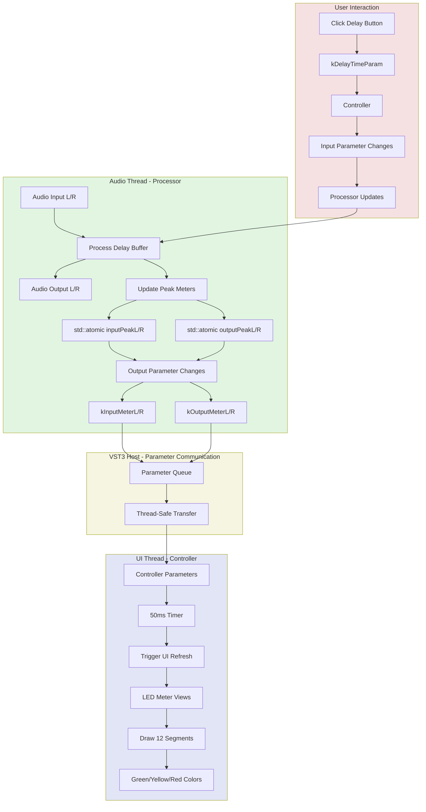
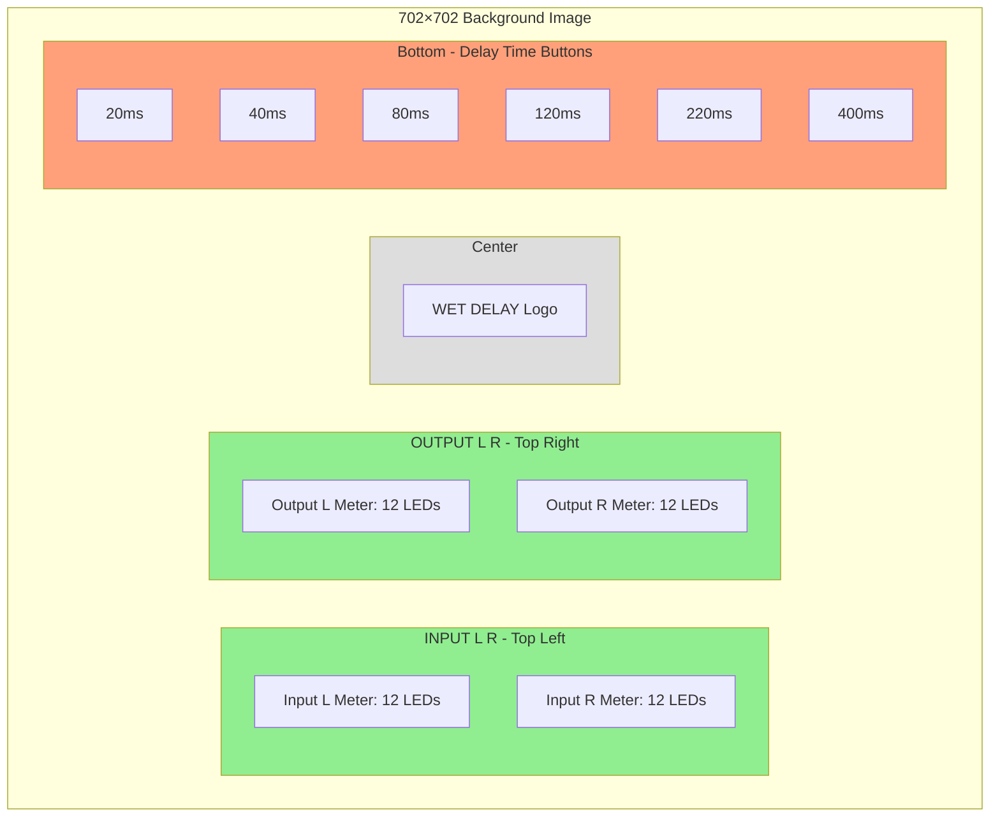
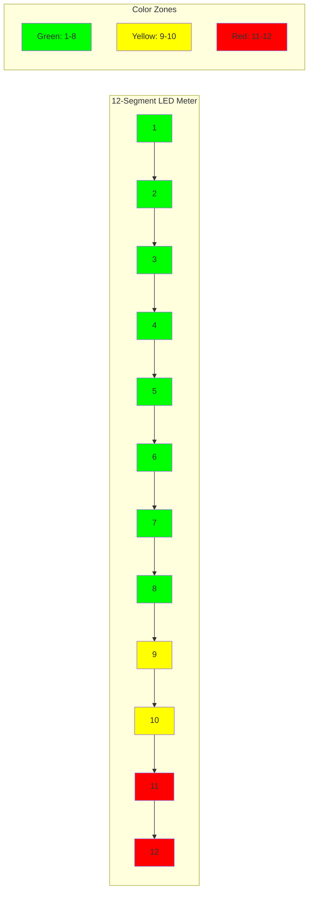
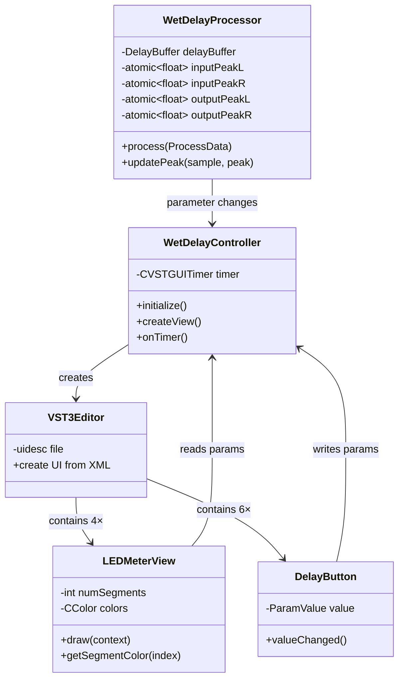
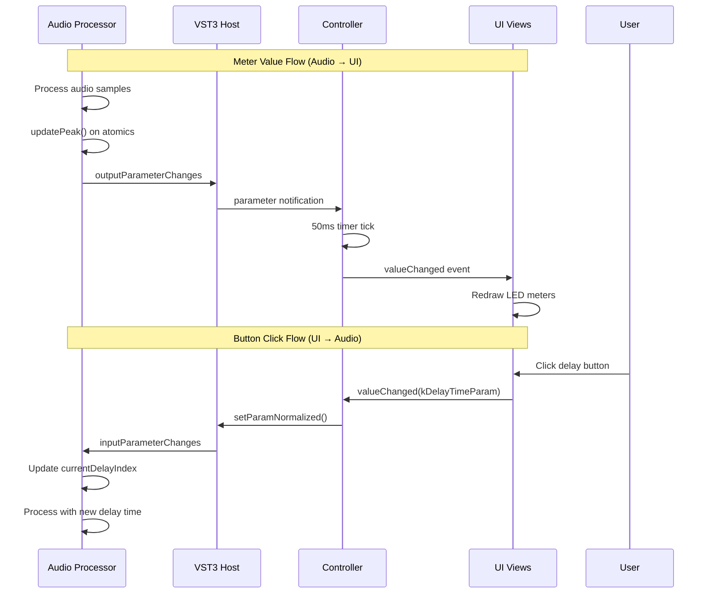

# WetDelay UI Architecture Diagram

## Data Flow: Audio Processing → UI Display



## UI Layout Map - 702×702 Pixel Canvas



## LED Meter Segment Display



## Component Hierarchy



## Parameter Routing



## Coordinate Reference Map

```
┌─────────────────────────────────────────────────────────────────┐  0
│                                                                 │
│   INPUT L R (50,45)              OUTPUT L R (395,45)           │  50
│   ┌─────────────────────┐       ┌─────────────────────┐       │
│   │ 🟢🟢🟢🟢🟢🟢🟢🟢🟡🟡🔴🔴 │       │ 🟢🟢🟢🟢🟢🟢🟢🟢🟡🟡🔴🔴 │       │  100
│   │ 🟢🟢🟢🟢🟢🟢🟢🟢🟡🟡🔴🔴 │       │ 🟢🟢🟢🟢🟢🟢🟢🟢🟡🟡🔴🔴 │       │  125
│   └─────────────────────┘       └─────────────────────┘       │  150
│                                                                 │
│                       WET DELAY                                 │  280
│                                                                 │
│   20ms  40ms  80ms  120ms 220ms 400ms                          │  420
│   ┌───┐ ┌───┐ ┌───┐ ┌───┐ ┌───┐ ┌───┐                        │  455
│   │   │ │   │ │   │ │   │ │   │ │   │                        │
│   │   │ │   │ │   │ │   │ │   │ │   │                        │  520
│   │   │ │   │ │   │ │   │ │   │ │   │                        │
│   └───┘ └───┘ └───┘ └───┘ └───┘ └───┘                        │  585
│                                                                 │
└─────────────────────────────────────────────────────────────────┘  702
0   35  145 255 365 475 585                                    702
```

## Implementation Checklist

### Code Files to Modify

- ✅ [`wetdelaycids.h`](WetDelay/source/wetdelaycids.h)
  - Add meter parameter IDs (4 new constants)
  
- ✅ [`wetdelayprocessor.cpp`](WetDelay/source/wetdelayprocessor.cpp)
  - Add meter value export in `process()` function
  - Use `outputParameterChanges->addParameterData()`
  
- ✅ [`wetdelaycontroller.h`](WetDelay/source/wetdelaycontroller.h)
  - Add `ITimerCallback` interface
  - Add timer member variable
  
- ✅ [`wetdelaycontroller.cpp`](WetDelay/source/wetdelaycontroller.cpp)
  - Register 4 meter parameters as read-only
  - Create and start timer in `createView()`
  - Implement `onTimer()` callback
  
- ✅ [`wetdelayeditor.uidesc`](WetDelay/resource/wetdelayeditor.uidesc)
  - Update viewport from 400×300 to 702×702
  - Add 4 LED meter views with precise coordinates
  - Add 6 delay button views with precise coordinates
  - Configure colors, fonts, and styling

### Testing Checklist

- ✅ Build plugin successfully
- ✅ Load in DAW without errors
- ✅ Input meters respond to incoming audio
- ✅ Output meters respond to delayed output
- ✅ LED segments light up in correct colors (green/yellow/red)
- ✅ Clicking delay buttons changes delay time
- ✅ Only one button active at a time
- ✅ Parameter automation works
- ✅ Visual alignment matches background image
- ✅ CPU usage remains low
- ✅ No audio glitches from UI updates

---

**Architecture Status: COMPLETE** ✅  
**Ready for Implementation: YES** ✅  
**Estimated Build Time: 2.5 hours** ⏱️